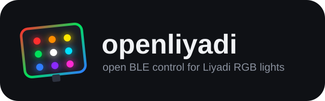

# openliyadi



[](LICENSE)
[](requirements.txt)
[](PROTOCOL.md)
[](led_controller.py)

Controllo open-source via **Bluetooth LE** per le luci fotografiche RGB
**Liyadi LP540-PRO** (e compatibili `LTF_MWRGB` / `LYD_MWRGB` / `Bough_Systems`).
L'app originale è distribuita solo come APK closed-source **fuori dal Play Store** —
quindi senza i controlli di sicurezza e gli aggiornamenti dello store. Questo
progetto ne reimplementa il protocollo in modo aperto e verificabile:
**niente cloud, niente account**, solo Python + BLE.

> Progetto non ufficiale, reverse engineering a fini di interoperabilità.
> Testato dal vivo: ON/OFF, RGB, CCT, HSI, 24 effetti, ambilight.

## ✨ Funzionalità

- 🎨 **Colori RGB reali** (percorso HSI del color picker originale, hue 1–360)
- ☀️ **CCT studio** 2500–8500 K con preset fotografici
- ⚡ **24 effetti di scena** (Flash, Candle, Police, Strobe, Chase, Firework, …)
- 🖥️ **Ambilight** stile Philips Hue: la lampada segue lo schermo
- 🔍 **Scanner BLE** con sonda GATT (trova la lampada anche senza nome)
- 🌐 **WebUI + API HTTP/WebSocket** per comandare tutto e integrarci altro sopra
- 📚 **Libreria C99** con gli stessi pacchetti, per app native/Android
- 🌍 WebUI in **italiano e inglese** (dalla lingua del browser)

## 🚀 Quickstart

```bash
pip install -r requirements.txt

# 1. Trova la lampada (una sola connessione BLE alla volta:
#    chiudi app/nRF del telefono prima!)
python led_scan.py --probe

# 2. Accendi e colora
python led_lyd.py --addr <MAC> on
python led_lyd.py --addr <MAC> rgb 255 0 0
python led_lyd.py --addr <MAC> off

# 3. WebUI completa
python server.py   # -> http://localhost:8080
```

## 🌐 API HTTP (per integrarci altro sopra)

Base: `http://localhost:8080` · WebSocket realtime: `ws://localhost:8080/ws`
(`{"action": "rgb"|"cct"|"hsi"|"brightness"|"power"|"effect"|"ambilight", "data": {...}}`)

| Metodo | Endpoint | Body JSON | Effetto |
|---|---|---|---|
| GET | `/api/status` | — | stato (power, rgb, cct, hsi, effetto, connessione) |
| GET | `/api/effects` | — | lista 24 effetti |
| POST | `/api/scan` | — (`?timeout=12`) | scansione BLE |
| POST | `/api/connect` | `{"address": "MAC"}` | connetti lampada |
| POST | `/api/disconnect` | — | disconnetti |
| POST | `/api/power` | `{"state": true/false}` | accendi/spegni veri |
| POST | `/api/rgb` | `{"r":…,"g":…,"b":…}` | colore HSI |
| POST | `/api/brightness` | `{"value": 0-100}` | luminosità |
| POST | `/api/cct` | `{"kelvin":…,"brightness":…}` | bianco studio |
| POST | `/api/hsi` | `{"hue":…,"saturation":…,"brightness":…}` | HSI diretto |
| POST | `/api/effect` | `{"effect": "Flash"/id…}` | effetto scena |
| GET | `/api/ambilight/monitors` | — | schermi disponibili |
| POST | `/api/ambilight/start` | `{"monitor":1,"fps":5}` | avvia ambilight |
| POST | `/api/ambilight/stop` | — | ferma ambilight |
| GET | `/api/ambilight/status` | — | stato + ultimo colore |

Esempio:

```bash
curl -X POST localhost:8080/api/rgb -H "Content-Type: application/json" \
  -d '{"r":0,"g":255,"b":0}'
```

## 🖥️ Ambilight

```bash
python ambilight.py --list            # schermi disponibili
python ambilight.py --monitor 2       # anteprima a console
python ambilight.py --monitor 2 --lamp  # invia alla lampada (5 fps, smoothing)
```

Media colore con smoothing esponenziale + boost saturazione, ~1–15 fps
configurabili. Anche da WebUI (tab 🖥️) e via API.

## 🧩 Struttura

| File | Cosa fa |
|---|---|
| `led_protocol.py` | **Client core Python**: pacchetti, RGB→HSI, CCT, effetti |
| `led_controller.py` | Client Windows WinRT persistente (connessione stabile, coda) |
| `led_lyd.py` | CLI bleak multipiattaforma (single-shot) |
| `led_scan.py` | Scanner BLE + sonda GATT (`--probe`) |
| `ambilight.py` | Ambilight da schermo (mss) |
| `server.py` | WebUI + API REST/WebSocket |
| `test_studio.py`, `test_rgb.py` | Smoke test dal vivo |
| `c/` | Libreria C99 + esempio + self-test |
| `PROTOCOL.md` | Documentazione completa del protocollo |
| `LED.apk` | App originale (riferimento) |

Dettagli protocollo: [`PROTOCOL.md`](PROTOCOL.md) · Libreria C: [`c/README.md`](c/README.md).

## 🤝 Compatibilità

Ogni lampada con service GATT `FFF0` (`FFF3` write / `FFF4` notify) e nomi
`LTF_MWRGB`/`LYD_MWRGB` dovrebbe funzionare — probabilmente tutta la famiglia
di controller di queste serie. Apri una issue con modello e comportamento.

## ☕ Supporto

[](https://buymeacoffee.com/dr_gaussx)

https://buymeacoffee.com/dr_gaussx

## 📄 Licenza

MIT — vedi [`LICENSE`](LICENSE). Il software è una release funzionante;
per chi vuole costruirci sopra c'è la libreria (Python e C).
